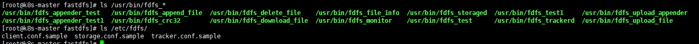
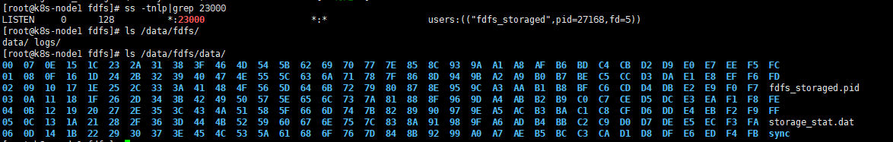
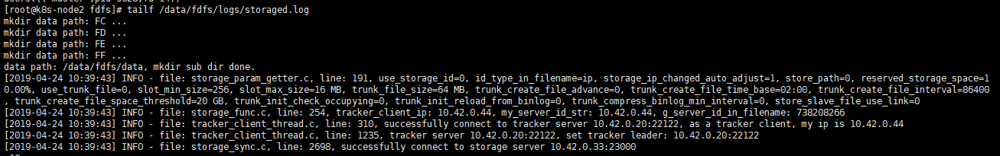
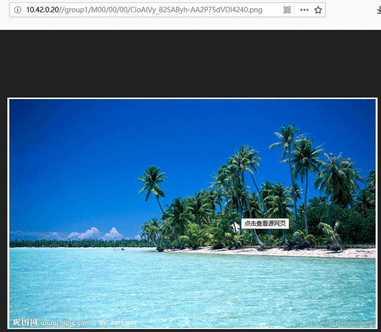

## 环境介绍

| 角色 | IP |
| --- | --- |
| trakcer | 10.1.42.0.20 |
| storage 1 | 10.1.42.0.33 |
| storage 2 | 10.42.0.44 |


####  `tracker`：跟踪服务器

跟踪服务器，主要做调度工作，起负载均衡的作用。在内存中记录集群中所有存储组和存储服务器的状态信息，是客户端和数据服务器交互的枢纽。相比GFS中的master更为精简，不记录文件索引信息，占用的内存量很少。

#### `storage`：存储服务器

存储服务器（又称：存储节点或数据服务器），文件和文件属性（meta data）都保存到存储服务器上。Storage server直接利用OS的文件系统调用管理文件。

#### client：客户端

客户端，作为业务请求的发起方，通过专有接口，使用TCP/IP协议与跟踪器服务器或存储节点进行数据交互。FastDFS向使用者提供基本文件访问接口，比如upload、download、append、delete等，以客户端库的方式提供给用户使用。

#### group：组

组， 也可称为卷。 同组内服务器上的文件是完全相同的 ，同一组内的storage server之间是对等的， 文件上传、 删除等操作可以在任意一台storage server上进行 。

#### meta data ：文件相关属性

文件相关属性，键值对（ Key Value Pair） 方式，如：width=1024,heigth=768


### 解决依赖

- 获取软件包
```
wget https://github.com/happyfish100/libfastcommon/archive/V1.0.36.tar.gz
wget https://github.com/happyfish100/fastdfs/archive/V5.12.tar.gz
wget http://nginx.org/download/nginx-1.16.0.tar.gz
```

- 时间同步：`ntpdate ntp.aliyun.com`
- 编译依赖：
  - `yum -y install gcc gcc-c++ libstdc++-devel pcre-devel zlib-devel wget make`
  - `yum -y groupinstall 'Development Tools' `
- 编译libfastcommon
```
src]# tar -xf V1.0.36.tar.gz  -C /usr/local/
src]# cd /usr/local/
local]# ln -sc libfastcommon-1.0.36 libfastcommon
local]# cd libfastcommon
libfastcommon]# ./make.sh
libfastcommon]# ./make.sh install
```

### 安装FastDFS[20/33/44]
```
src]# tar -xf V5.11.tar.gz  -C /usr/local/
src]# cd /usr/local/
local]# ln -sv fastdfs-5.11/ fastdfs
local]# cd fastdfs
fastdfs]# ./make.sh
fastdfs]# ./make.sh  install
```
安装好之后可以看到各种`fdfs_`的命令和配置文件


### 安装Tracker Server 【20】

将`tracker.conf.sample`文件重命名为`tracker.conf`，然后修改配置文件`/etc/fdfs/tracker.conf`
```
fastdfs]# cd /etc/fdfs/
fdfs]# mv tracker.conf.sample tracker.conf
fdfs]# vim tracker.conf
  disabled=false              #启用配置文件
  base_path=/data/fdfs        #设置tracker的数据文件和日志目录（需手动创建）
  port=22122                  # tracker 服务的端口
  http.server_port=8080       # tracker 服务的http端口
fdfs]# mkdir /data/fdfs -pv
fdfs]# /etc/init.d/fdfs_trackerd  start
```


### 安装Storage Server 【33/44】
将存储节点分为一个组`group1`(33/44),
```
fastdfs]# cd /etc/fdfs/
fdfs]# mv storage.conf.sample  storage.conf
fdfs]# vim storage.conf
  group_name=group1       # 组名（第一组为group1，第二组为group2，依次类推...）
  base_path=/data/fdfs    # 数据和日志文件存储根目录
  store_path0=/data/fdfs          #第一个存储目录，第二个存储目录起名为：store_path1=xxx，其它存储目录名依次类推...
  store_path_count=1                  # 存储路径个数，需要和store_path个数匹配
  tracker_server=10.42.0.20:22122          # tracker服务器IP和端口,可有多个
  # tracker_server=
fdfs]# /etc/init.d/fdfs_storaged start     
```



### 验证
- 查看storage的日志是否启动成功

- 在任意节点上`fdfs_monitor /etc/fdfs/storage.conf`

至此，tracker、storage等配置都完成并成功启动。接下来，继续完成Nginx和fastdfs-nginx-module的安装和配置

### 在storage上安装nginx(支持`fastdfs-nginx-module`)
```
src]# tar -xf nginx-1.16.0.tar.gz -C /usr/local
src]# cd /usr/local/
local]# git clone https://github.com/happyfish100/fastdfs-nginx-module.git
local]# ln -sv nginx-1.16.0/ nginx
local]# cd nginx
# 设置软连接
nginx]# ln -sv  /usr/include/fastcommon /usr/local/include/fastcommon
nginx]# ln -sv /usr/include/fastdfs /usr/local/include/fastdfs
nginx]# ln -sv /usr/lib64/libfastcommon.so /usr/local/lib/libfastcommon.so
nginx]# ./configure --prefix=/opt/nginx --add-module=/usr/local/fastdfs-nginx-module/src
nginx]# make install
```

编译报错解决办法：
- [致命错误：common_define.h：没有那个文件或目录](https://github.com/happyfish100/fastdfs-nginx-module/issues/32)
- [FDFSHTTPParams’没有名为‘support_multi_range](https://github.com/happyfish100/fastdfs-nginx-module/issues/10)

```
#配置fastdfs-nginx-module
local]# cp fastdfs-nginx-module/src/mod_fastdfs.conf  /etc/fdfs/
local]# vim /etc/fdfs/mod_fastdfs.conf
  base_path=/data/fdfs           #保存日志目录
  tracker_server=10.42.0.20:22122
  storage_server_port=23000         #storage服务器的端口号
  group_name=group1                 #当前服务器的group名
  url_have_group_name = true        #文件url中是否有group名
  store_path_count=1                #存储路径个数，需要和store_path个数匹配
  store_path0=/data/fdfs         #存储路径
  group_count = 2                   #设置组的个数
  [group1]
  group_name=group1
  storage_server_port=23000
  store_path_count=1
  store_path0=/data/fdfs
  store_path1=/data/fdfs

#建立M00至存储目录的符号连接
ln -sv /data/fdfs/data /data/fdfs/M00
```
```
#配置nginx
local]# vim /opt/nginx/conf/nginx.conf
  user root;
  ...
  location ~/group1/M00 {
          root /data/hdfs/data;
          ngx_fastdfs_module;
  }
 ...
# 复制fastdfs中的http.conf、mime.types文件到/etc/fdfs
local]# cp /usr/local/fastdfs-5.11/conf/http.conf /usr/local/fastdfs-5.11/conf/mime.types /etc/fdfs/
~]# scp /etc/fdfs/http.conf /etc/fdfs/mod_fastdfs.conf /etc/fdfs/mime.types 10.42.0.44:/etc/fdfs/
```
```
# 启动nginx
~]# cd /opt/nginx/
nginx]# ./sbin/nginx  -
```
**Note**：fastdfs-nginx-module模块只需要安装到storage上

### 在tracker上安装nginx
在tracker上安装的nginx主要为了提供http访问的反向代理、负载均衡以及缓存服务

```
src]# tar -xf nginx-1.16.0.tar.gz  -C /usr/local/
src]# cd ../nginx-1.16.0/
nginx-1.16.0]# ./configure  --prefix=/usr/local/nginx
nginx-1.16.0]# make
nginx-1.16.0]# make install
```
```
#配置nginx
~]# vim /usr/local/nginx/conf/nginx.conf
  worker_processes  4;                  #根据CPU核心数而定
  events {
      worker_connections  65535;        #最大链接数
      use epoll;                        #新版本的Linux可使用epoll加快处理性能
  }
  http {
    upstream fdfs_group1 {
        server 10.42.0.33:80 weight=1 max_fails=2 fail_timeout=30s;
        server 10.42.0.44:80 weight=1 max_fails=2 fail_timeout=30s;
    }
    server {
        location /group1/M00 {
        proxy_pass http://fdfs_group1;
        }
    }
  }
```
```
~]# cd /usr/local/nginx/conf/
~]# ../sbin/nginx -t
~]# ../sbin/nginx
```

至此，我们一个完整的架构已经搭建完成，接下来我们要进行测试了

### 测试验证
- 手动上传一个图片
```
~]# cp /etc/fdfs/client.conf.sample /etc/fdfs/client.conf
base_path=/root/fastdfs                   #日志存放路径
tracker_server=10.42.0.20:22122         
http.tracker_server_port=8080
```
```
~]# fdfs_upload_file /etc/fdfs/client.conf test.png
group1/M00/00/00/CioAIVy_82SAByh-AA2P75dVDl4240.png
```

